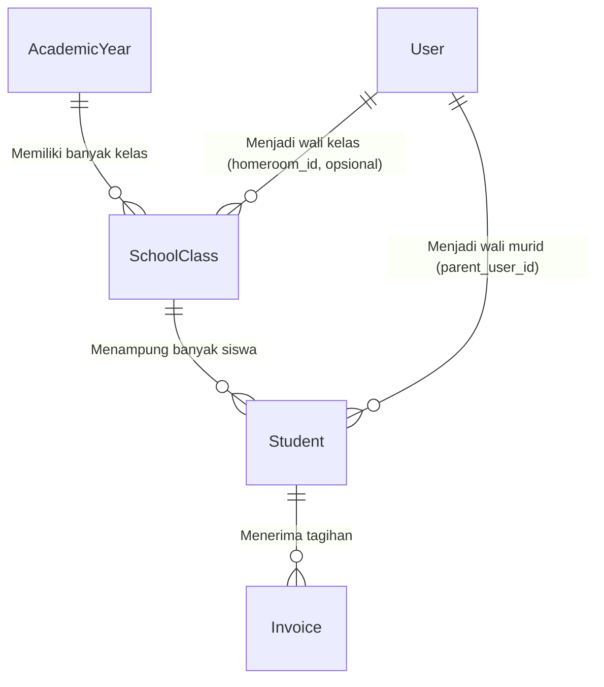

# 📓 Jurnal Belajar SIPAS-Hub
**Topik Utama:** Memahami Model, Relasi Database, dan Struktur Akademik (`User`, `Student`, `SchoolClass`, & `AcademicYear`)
**Peran Mentor:** Senior Developer & Guru Coding

---

## 🌟 Pendahuluan
Sebelum memulai membuat tampilan (UI) atau fitur pembayaran, kita harus memahami dasar dari aplikasi web, yaitu **data**. Di Laravel, data dikelola melalui **Eloquent Model**. Model bertindak sebagai jembatan antara kode PHP kita dengan tabel di database MySQL.

Dalam jurnal ini, kita membedah 4 model data utama yang saling berhubungan:
1.  **User**: Pengguna sistem (Admin Keuangan, Orang Tua, dan Guru).
2.  **Student**: Data murid sekolah.
3.  **SchoolClass**: Kelas belajar murid.
4.  **AcademicYear**: Tahun ajaran yang aktif.

---

## 📂 Bagian 1: Memahami Model Utama (`User` & `Student`)

### 1. Membedah Model `User.php`
Buka file asli di: [User.php](file:///d:/latihan%20project/pest_pay/pest_pay1/app/Models/User.php)

Model `User` mewakili tabel `users` di database. Model ini spesial karena mewarisi kelas `Authenticatable` (artinya pengguna ini bisa login ke aplikasi).

*   **Traits (Kemampuan Tambahan):**
    *   `HasFactory`: Digunakan untuk membuat data palsu saat pengujian.
    *   `HasRoles`: Berasal dari paket **Spatie Laravel-Permission** untuk membagi peran login (misalnya: "Admin Keuangan", "Orang Tua").
    *   `TwoFactorAuthenticatable`: Fitur bawaan **Laravel Fortify** untuk mendukung autentikasi 2-langkah (2FA/OTP).
*   **Relasi Orang Tua ke Siswa:**
    ```php
    public function students(): HasMany
    {
        return $this->hasMany(Student::class, 'parent_user_id');
    }
    ```
    Satu User (wali murid) bisa memiliki banyak anak (`Student`) di sekolah tersebut. Kolom penghubungnya adalah `parent_user_id` di tabel siswa.
*   **Fungsi Helper `initials()`:**
    Membuat inisial nama untuk avatar profil. Jika namanya "Budi Prasetyo", akan dipotong menjadi "BP".

---

### 2. Membedah Model `Student.php`
Buka file asli di: [Student.php](file:///d:/latihan%20project/pest_pay/pest_pay1/app/Models/Student.php)

Model `Student` menyimpan data lengkap siswa di sekolah.

*   **Pembuatan NIS Otomatis di Fungsi `boot()`:**
    ```php
    static::creating(function ($student) {
        if (empty($student->nis)) {
            $entryYear = $student->entry_year ?? date('Y');
            $prefix = substr($entryYear, -2); // Ambil 2 digit terakhir tahun (misal: 2026 -> 26)

            $lastStudent = self::where('nis', 'like', $prefix.'%','and')
                ->orderBy('id', 'desc')
                ->first();

            $sequence = 1;
            if ($lastStudent) {
                $lastSequence = (int) substr($lastStudent->nis, -4);
                $sequence = $lastSequence + 1;
            }

            $student->nis = $prefix . str_pad($sequence, 4, '0', STR_PAD_LEFT);
        }
    });
    ```
    > [!NOTE]
    > Logika ini berjalan otomatis sebelum baris data tersimpan di database. Memastikan NIS selalu urut dengan format `[TahunMasuk][Urutan]`, contoh: siswa pertama yang masuk tahun 2026 NIS-nya adalah `260001`.

*   **Relasi Siswa ke Kelas:**
    ```php
    public function schoolClass(): BelongsTo
    {
        return $this->belongsTo(SchoolClass::class);
    }
    ```
    Setiap siswa wajib terdaftar di satu kelas saja (misalnya kelas 7-A).

---

## 🏫 Bagian 2: Menjelajahi Model Akademik (`SchoolClass` & `AcademicYear`)

### 1. Membedah Model `SchoolClass.php`
Buka file asli di: [SchoolClass.php](file:///d:/latihan%20project/pest_pay/pest_pay1/app/Models/SchoolClass.php)

Model `SchoolClass` mewakili kelas fisik di sekolah (contoh: Kelas 7-A, Kelas 8-B).

*   **Relasi Wali Kelas (Custom Foreign Key):**
    ```php
    public function homeroomTeacher(): BelongsTo
    {
        return $this->belongsTo(User::class, 'homeroom_id');
    }
    ```
    > [!NOTE]
    > Secara default, Laravel menebak kolom penghubung model `User` adalah `user_id`. Karena di tabel kelas kolomnya dinamakan `homeroom_id`, kita menuliskan `'homeroom_id'` secara manual sebagai parameter kedua.

---

### 2. Membedah Model `AcademicYear.php`
Buka file asli di: [AcademicYear.php](file:///d:/latihan%20project/pest_pay/pest_pay1/app/Models/AcademicYear.php)

Model `AcademicYear` mewakili tahun ajaran aktif sekolah (contoh: 2025/2026).

*   **Relasi Siswa Melalui Kelas (Has Many Through):**
    ```php
    public function students(): HasManyThrough
    {
        return $this->hasManyThrough(Student::class, SchoolClass::class);
    }
    ```
    > [!IMPORTANT]
    > Tabel `students` tidak punya kolom `academic_year_id`. Namun, siswa terhubung ke Kelas, dan Kelas terhubung ke Tahun Ajaran.
    > Dengan `hasManyThrough(Student::class, SchoolClass::class)`, kita memerintahkan Laravel mengambil semua **Siswa (Student)** yang berada di dalam **Kelas (SchoolClass)** yang terdaftar di Tahun Ajaran ini secara instan menggunakan satu query gabungan.

---

## 📊 Visualisasi Relasi Database (Hubungan Antar Tabel)

Berikut adalah diagram hubungan antara keempat model di database kita:



---

## ❓ Tanya & Jawab (Q&A)

### A. Mengapa ada simbol `#[ ]` di atas deklarasi Kelas?
Simbol `#[ ]` adalah fitur PHP 8.0+ yang dinamakan **Attributes** (mirip *Annotations* di Java/TypeScript).
*   **Cara Lama (PHP 7):** Konfigurasi ditulis di dalam kelas menggunakan variabel.
    ```php
    protected $fillable = ['name', 'email'];
    ```
*   **Cara Baru (PHP 8):** Konfigurasi ditaruh di luar/atas kelas.
    ```php
    #[Fillable(['name', 'email'])]
    class User extends Authenticatable { }
    ```
*   **Keunggulan:** Membuat isi kelas lebih bersih, terlihat lebih deklaratif di paling atas, dan lebih cepat dianalisis oleh editor kode (VS Code) untuk mencegah eror sebelum program dijalankan.

### B. Mengapa kita tidak membuat tabel `wali_kelas` terpisah?
*   **Reusability (Penggunaan Kembali):** Wali kelas, admin, dan orang tua semuanya adalah **pengguna (manusia)** yang butuh akun untuk login (punya email & password). Menggabungkannya ke tabel `users` mencegah duplikasi data.
*   **Role vs Metadata:** Di sistem kita saat ini, Wali Kelas tidak memiliki dashboard login khusus (hanya Admin dan Orang Tua yang login). Jadi, kita tidak memerlukan Role "Wali Kelas". Kolom `homeroom_id` pada kelas hanya berfungsi sebagai **Metadata** (informasi pendukung) agar nama guru tersebut bisa ditampilkan sebagai info wali kelas anak.
*   **Nullable:** Kolom `homeroom_id` dibuat sebagai `nullable()` di database. Ini berarti kolom tersebut boleh kosong (`NULL`), sehingga sistem tidak akan eror saat kita membuat kelas tanpa menentukan wali kelasnya terlebih dahulu.

---

## 📚 Glosarium: Visibilitas & Metode Static (OOP PHP)

### 1. Perbedaan Visibilitas (Aksesibilitas)

Visibilitas menentukan **siapa saja yang boleh memanggil** sebuah fungsi (*method*) atau membaca sebuah variabel (*property*).

| Keyword | Arti | Akses dari Luar Kelas? | Akses dari Kelas Anak (Subclass)? |
| :--- | :--- | :---: | :---: |
| **`public`** | Terbuka untuk umum | ✅ Ya | ✅ Ya |
| **`protected`** | Terlindungi (Hanya keluarga) | ❌ Tidak | ✅ Ya |
| **`private`** | Rahasia Pribadi | ❌ Tidak | ❌ Tidak |

*   **`public`**: Bisa diakses dari mana saja. Contoh: `$student->invoices()` dipanggil di halaman web mana pun untuk menampilkan daftar tagihan siswa.
*   **`protected`**: Hanya bisa dipanggil di dalam kelas itu sendiri dan kelas keturunannya. Contoh: fungsi `boot()` di dalam Model dilindungi agar framework Laravel saja yang menjalankannya saat memuat Model.
*   **`private`**: Hanya bisa dibaca oleh kelas itu sendiri. Kelas anak sekalipun tidak bisa memanggilnya.

### 2. Apa itu `static`?

*   **Non-static (Default):** Fungsi menempel pada **objek individu**. Kamu harus memiliki objek siswa terlebih dahulu (`$student = new Student()`), baru bisa memanggil nama/inisialnya (`$student->initials()`).
*   **Static:** Fungsi menempel pada **Kelas itu sendiri**. Kamu bisa langsung memanggilnya tanpa menggunakan kata kunci `new`. Contoh: `Student::where(...)`.
*   **Kenapa `boot()` bersifat static?** Karena Laravel menginisialisasinya pada tingkat *Kelas* saat pertama kali dimuat di memori, bukan saat ada data murid baru dibuat.

---

## 💡 Rangkuman dari Senior
*   **Model** selalu memetakan tabel tunggal di database.
*   **Relasi** (seperti `belongsTo`, `hasMany`) mempermudah kita mengambil data terkait tanpa perlu menulis query SQL gabungan (`JOIN`) yang rumit secara manual.
*   **Custom Foreign Key** digunakan ketika nama kolom di database tidak mengikuti standar penamaan Laravel (yaitu `[nama_model]_id`).
*   **Has Many Through** sangat berguna untuk menembus relasi bertingkat tanpa harus menulis kode pengulangan (`foreach`) yang memakan memori dan memperlambat aplikasi.
*   **Reusability Tabel** memungkinkan kita menggunakan tabel `users` untuk berbagai kebutuhan relasi (seperti wali kelas via `homeroom_id` atau wali murid via `parent_user_id`) tanpa membuat tabel baru secara berlebihan.
