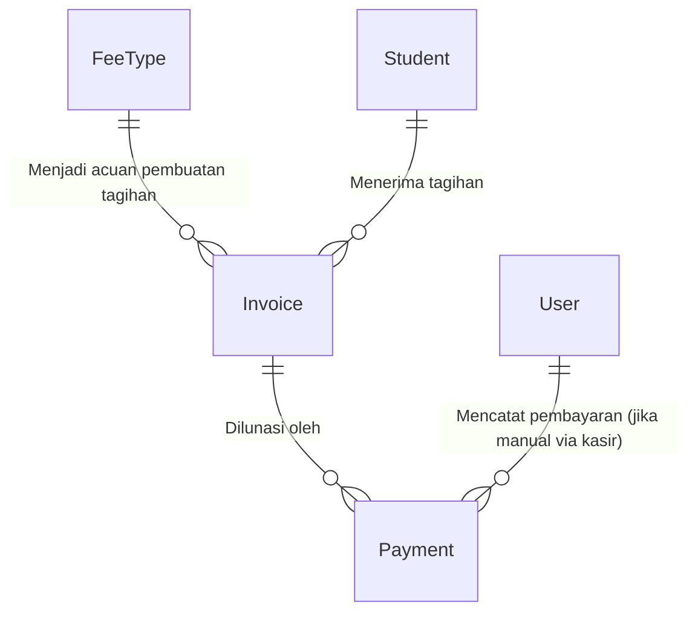

# 📓 Jurnal Belajar SIPAS-Hub — Jantung Sistem Pembayaran
**Topik Utama:** Membedah Model Keuangan (`FeeType`, `Invoice`, & `Payment`)
**Peran Mentor:** Senior Developer & Guru Coding

---

## 🌟 Pendahuluan
Hari ini kita melangkah ke **jantung utama aplikasi SIPAS-Hub**, yaitu **Sistem Pembayaran**. Di sini kita mengelola jenis tagihan, pembuatan invoice untuk siswa, dan pencatatan transaksi pembayaran. 

Kita akan membedah tiga model utama:
1.  **FeeType (Jenis Biaya):** Master data kategori tagihan (seperti SPP bulanan, Uang Kegiatan, dsb).
2.  **Invoice (Tagihan):** Lembar tagihan konkret yang ditujukan ke siswa tertentu dengan nominal tertentu.
3.  **Payment (Pembayaran):** Bukti bayar dari orang tua (baik via transfer otomatis Midtrans maupun bayar tunai ke kasir).

---

## 1. Membedah Model `FeeType.php`
Buka file asli di: [FeeType.php](file:///d:/latihan%20project/pest_pay/pest_pay1/app/Models/FeeType.php)

`FeeType` menyimpan konfigurasi biaya sekolah.

### 🔍 Bedah Baris Kode Penting:

### A. Decimal Casting (Pencegahan Eror Pembulatan Keuangan)
```php
protected function casts(): array
{
    return [
        'default_amount' => 'decimal:2',
        'is_recurring' => 'boolean',
        'applicable_grades' => 'json',
    ];
}
```
*   > [!IMPORTANT]
    > **Mengapa `'decimal:2'`?**
    > Dalam aplikasi keuangan, kita **tidak boleh** menyimpan nominal uang sebagai tipe data `float` atau `double` karena komputer sering kali melakukan pembulatan bilangan desimal biner yang tidak akurat (misal `19999.99999`). 
    > Dengan meng-cast ke `'decimal:2'`, Laravel memastikan nominal uang selalu dibaca secara konsisten hingga 2 digit di belakang koma (misal: `Rp 250000.00`).

---

## 2. Membedah Model `Invoice.php`
Buka file asli di: [Invoice.php](file:///d:/latihan%20project/pest_pay/pest_pay1/app/Models/Invoice.php)

`Invoice` diterbitkan untuk siswa berdasarkan template dari `FeeType`.

### 🔍 Konsep Eloquent Accessor (Getter Dinamis)
Dalam model `Invoice`, terdapat fungsi unik ini:
```php
public function getBillingDetailAttribute(): string
{
    if ($this->feeType && $this->feeType->category === 'SPP' && $this->period_month) {
        $monthName = \Carbon\Carbon::create()->month($this->period_month)->translatedFormat('F');
        return "SPP Bulan {$monthName} {$this->period_year}";
    }

    return $this->feeType ? $this->feeType->name : 'Tagihan';
}
```

*   **Apa itu Accessor?**
    Accessor adalah cara membuat **properti buatan (virtual)** yang dinamis di Laravel.
*   **Cara Pemanggilan:**
    Di dalam kode PHP atau tampilan HTML kita, kita cukup memanggil `$invoice->billing_detail`. 
    Laravel secara otomatis akan memproses nama fungsi di atas (aturan penamaan: diawali `get`, diikuti nama properti CamelCase, diakhiri `Attribute`).
*   **Logikanya:**
    Jika tagihan tersebut berkategori "SPP" dan ditujukan untuk bulan 7 tahun 2026, properti ini otomatis menghasilkan teks: **"SPP Bulan Juli 2026"**. Jika bukan SPP, ia hanya mengembalikan nama biayanya saja (misal: "Uang Study Tour").

---

## 3. Membedah Model `Payment.php`
Buka file asli di: [Payment.php](file:///d:/latihan%20project/pest_pay/pest_pay1/app/Models/Payment.php)

`Payment` mencatat transaksi pembayaran yang sukses dilakukan untuk melunasi sebuah `Invoice`.

### 🔍 Fitur Menarik: Accessor "Terbilang" untuk Kwitansi PDF
Kwitansi pembayaran yang sah biasanya mencantumkan nominal angka dan juga tulisan ejaannya (terbilang). Di model ini, kita memiliki fungsi accessor terbilang:

```php
public function getTerbilangAmountAttribute(): string
{
    return $this->penyebut((int) $this->amount);
}
```
*   **Cara kerja:** Jika nominal pembayaran adalah `Rp 150000.00` (`$payment->amount`), maka saat kita memanggil `$payment->terbilang_amount`, fungsi ini akan memproses fungsi rekursif `penyebut()` dan menghasilkan string: **" Seratus Lima Puluh Ribu"**. Ini sangat berguna saat mencetak PDF Kwitansi resmi!

---

## 📊 Visualisasi Relasi Keuangan (Alur Pembayaran)

Berikut adalah diagram hubungan alur data keuangan dari pembuatan kategori biaya hingga pembayaran:



---

## 🛡️ Mengenal Trait `Auditable` (Audit Trail Keuangan)

Di ketiga model di atas, terdapat baris kode ini:
```php
use App\Traits\Auditable;
```

Dalam sistem keuangan sekolah, kita harus mencatat setiap aksi penting. Jika seorang admin mengubah nominal tagihan siswa secara tiba-tiba dari Rp 250.000 menjadi Rp 50.000, sistem harus mencatat **siapa yang mengubah**, **kapan**, dan **dari alamat IP mana**.
*   Trait `Auditable` ini mendengarkan event Eloquent (`created`, `updated`, `deleted`).
*   Setiap kali ada perubahan data pada `FeeType`, `Invoice`, atau `Payment`, sistem secara otomatis menulis log ke tabel `audit_logs` tanpa kita perlu menulis kode log manual di setiap controller.

---

## ❓ Q&A: Bagaimana Cara Kerja Library Carbon untuk Menghasilkan Nama Bulan?

Pada file [Invoice.php:L53](file:///d:/latihan%20project/pest_pay/pest_pay1/app/Models/Invoice.php#L53), kita melihat potongan kode ini:
```php
$monthName = \Carbon\Carbon::create()->month($this->period_month)->translatedFormat('F');
```

Mari kita bedah rangkaian fungsi (*method chaining*) di atas dari kiri ke kanan:

1. **`\Carbon\Carbon::create()`**
   * **Fungsi:** Membuat objek penanggalan baru (secara default berisi waktu saat ini: hari ini, jam ini). **Carbon** adalah library pengolah tanggal bawaan Laravel yang sangat populer karena mempermudah manipulasi waktu di PHP.

2. **`->month($this->period_month)`**
   * **Fungsi:** Mengubah bulan dari objek Carbon tadi menjadi bulan yang kita inginkan berdasarkan angka dari database (`$this->period_month`).
   * **Contoh:** Jika nilai di database adalah `7`, maka tanggal Carbon tersebut diubah bulannya menjadi bulan Juli.

3. **`->translatedFormat('F')`**
   * **Fungsi:** Memformat tanggal tersebut menjadi nama bulan penuh.
   * **Mengapa tidak menggunakan `format('F')` biasa?** 
     Jika menggunakan `format('F')` bawaan PHP, hasilnya akan selalu bahasa Inggris (seperti *"July"*). 
     Dengan `translatedFormat('F')`, Carbon akan **menerjemahkan** nama bulan tersebut secara otomatis sesuai bahasa aplikasi kita saat ini (yaitu **Bahasa Indonesia**, sehingga menghasilkan *"Juli"*).

---

## 💡 Rangkuman Keuangan untuk Pemula
1.  **FeeType** adalah cetakan kuenya, **Invoice** adalah kue yang dibagikan ke siswa, dan **Payment** adalah pembayaran untuk kue tersebut.
2.  Gunakan tipe data **Decimal** untuk nilai uang agar tidak terjadi kesalahan pembulatan angka.
3.  **Accessor** mempermudah kita membuat teks dinamis (seperti format nama SPP bulanan atau konversi terbilang kwitansi) langsung dari model.
4.  **Carbon** dengan `translatedFormat()` memudahkan kita mengubah angka bulan (seperti `7`) menjadi kata utuh berbahasa lokal (seperti `Juli`).

