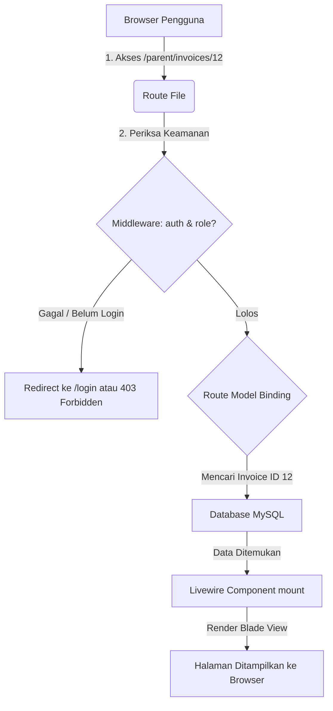

# 📓 Jurnal Belajar SIPAS-Hub — Routing & Middleware
**Topik Utama:** Peta Navigasi Aplikasi (`routes/web.php` & `routes/parent.php`) & Proteksi Halaman
**Peran Mentor:** Senior Developer & Guru Coding

---

## 🌟 Pendahuluan
Setelah memahami bagaimana data disimpan di database (Model), sekarang kita akan mempelajari bagaimana cara mengarahkan pengguna ke data tersebut melalui alamat web (URL). Di Laravel, sistem pengatur alamat ini dinamakan **Routing**, dan sistem penjaganya dinamakan **Middleware**.

Hari ini, kita akan membedah dua file rute utama:
1.  **[routes/web.php](file:///d:/latihan%20project/pest_pay/pest_pay1/routes/web.php):** Gerbang utama rute aplikasi.
2.  **[routes/parent.php](file:///d:/latihan%20project/pest_pay/pest_pay1/routes/parent.php):** Rute khusus untuk modul Portal Orang Tua.

---

## 1. Bagaimana Cara Kerja Routing di Laravel?

Mari kita perhatikan salah satu rute di `routes/parent.php`:
```php
Route::get('/parent/dashboard', Dashboard::class)->name('parent.dashboard');
```

Jika kita bedah baris kode di atas:
*   **`Route::get`**: Mengindikasikan bahwa halaman ini diakses menggunakan metode HTTP **GET** (mengambil tampilan halaman).
*   **`/parent/dashboard`**: Alamat URL yang diketik pengguna di browser (contoh: `situs.com/parent/dashboard`).
*   **`Dashboard::class`**: Livewire Component (PHP Class) yang bertanggung jawab memproses logika halaman ini dan merendernya.
*   **`->name('parent.dashboard')`**: Menamai rute tersebut. 

> [!TIP]
> **Mengapa Rute Harus Dinamai (`->name()`)?**
> Menamai rute adalah praktik terbaik (*best practice*). Jika di kemudian hari kita ingin mengubah URL `/parent/dashboard` menjadi `/orang-tua/beranda`, kita **tidak perlu** mencari dan mengganti URL tersebut di ratusan file HTML/Blade kita. 
> Selama kita menggunakan pemanggilan rute dinamis `route('parent.dashboard')`, Laravel otomatis akan menyesuaikannya.

---

## 2. Route Parameter & Route Model Binding (Pencarian Otomatis)

Perhatikan rute dinamis ini:
```php
Route::get('/parent/invoices/{invoice}', InvoiceDetail::class)->name('parent.invoices.show');
```

### A. Route Parameter `{invoice}`
Simbol `{invoice}` adalah parameter dinamis (wildcard). URL ini bisa diakses dengan `/parent/invoices/1`, `/parent/invoices/25`, dsb. Angka `1` atau `25` tersebut mewakili ID Invoice yang ingin dilihat.

### B. Route Model Binding (Sihir Laravel)
Di dalam Livewire Component `InvoiceDetail.php`, kita menangkap data ini dengan menuliskan tipe data Model secara eksplisit:

```php
public Invoice $invoice;

public function mount(Invoice $invoice) {
    // Data invoice otomatis sudah terisi dari database!
}
```

> [!IMPORTANT]
> **Apa itu Route Model Binding?**
> Jika nama parameter di rute (`{invoice}`) **sama persis** dengan nama variabel di fungsi controller/Livewire (`$invoice`), Laravel secara otomatis akan melakukan query ke database di belakang layar:
> `Invoice::findOrFail(id_dari_url)`
> Jika data ditemukan, objek `Invoice` langsung dimasukkan ke dalam variabel. Jika tidak ditemukan, Laravel otomatis mengembalikan halaman **404 Not Found**. Kita tidak perlu menulis query manual lagi!

---

## 3. Middleware: Penjaga Pintu Masuk Halaman

Bagaimana kita mencegah seorang murid mengakses halaman admin bendahara sekolah, atau sebaliknya? Caranya adalah dengan menggunakan **Middleware**.

Perhatikan pembungkus rute berikut di `routes/parent.php`:
```php
Route::middleware(['auth', 'verified', 'role:Orang Tua'])->group(function () {
    // Semua rute di dalam sini dilindungi oleh middleware!
});
```

*   **Apa itu Middleware?**
    Middleware adalah lapisan filter (penjaga pintu) yang memeriksa setiap permintaan (request) HTTP yang masuk sebelum diperbolehkan mengakses halaman tujuan.

### 🔍 Analisis 3 Middleware di Atas:

1.  **`auth`**:
    Memeriksa apakah pengunjung sudah login. Jika belum login, request akan langsung ditolak dan dialihkan kembali ke halaman `/login`.
2.  **`verified`**:
    Memeriksa apakah akun pengguna sudah memverifikasi alamat email mereka.
3.  **`role:Orang Tua`**:
    Ini adalah middleware dari paket **Spatie Laravel-Permission**. Ia memeriksa apakah user yang login memiliki peran (*role*) sebagai "Orang Tua". Jika seorang Admin mencoba masuk ke `/parent/dashboard`, middleware ini akan langsung memblokir akses dan mengembalikan respons **403 Forbidden**.

---

## 📊 Alur Kerja Permintaan Web (Request Lifecycle)

Berikut adalah diagram alur ketika pengguna mencoba mengakses halaman di SIPAS-Hub:



---

## 💡 Rangkuman Routing untuk Pemula
1.  **Route** memetakan URL di browser ke class PHP yang memprosesnya.
2.  Selalu beri **Nama Rute** (`name()`) agar rute di aplikasi kita dinamis dan mudah diubah.
3.  **Route Model Binding** secara otomatis mencari data di database berdasarkan ID di URL, menghemat penulisan kode pencarian manual.
4.  **Middleware** bertindak sebagai satpam halaman web (seperti membatasi akses berdasarkan status login dan peran pengguna).
