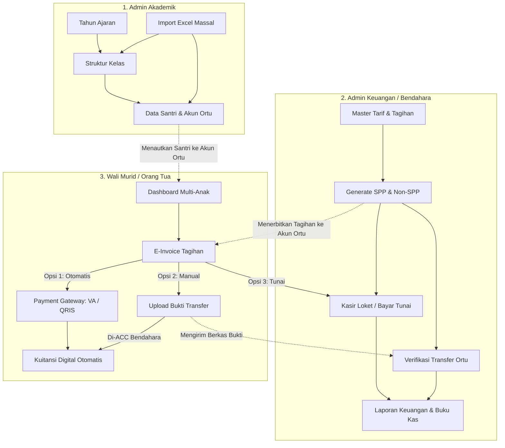
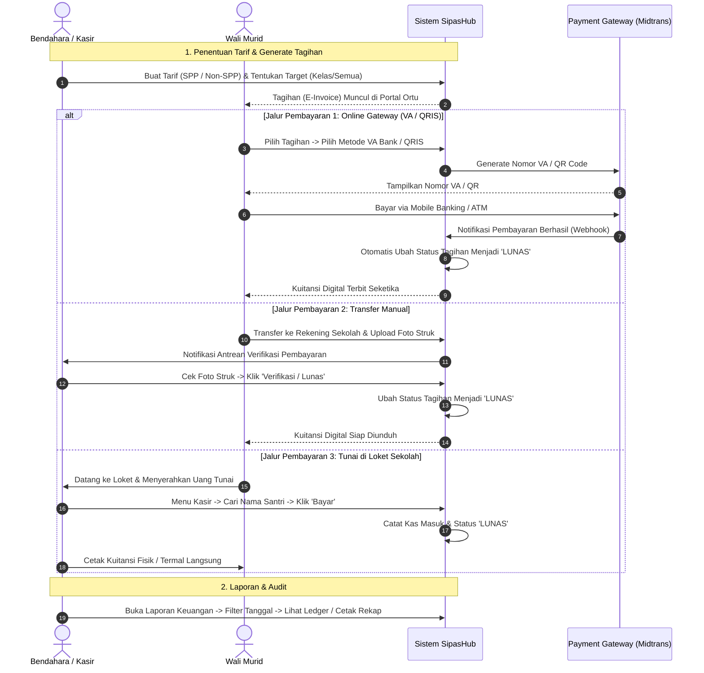

# Panduan Lengkap Alur Kerja (Workflow) & Panduan Pengguna: SipasHub
**Sistem Informasi Terpadu Administrasi Keuangan & Akademik Sekolah / Pesantren**

> **🌟 Akses Demo Tersedia:**
> Anda dapat mempraktikkan langsung seluruh panduan di bawah ini dengan mengakses aplikasi SipasHub secara live melalui tautan: **[sipashub.my.id](https://sipashub.my.id)**. Sangat disarankan untuk mencoba dan mengeksplorasi fitur-fitur di dalam demo tersebut sembari membaca panduan ini.

---

## 1. Ikhtisar Arsitektur Pengguna (User Roles)

SipasHub dirancang dengan memisahkan hak akses menjadi dua lingkungan utama:
1. **Portal Manajemen Sekolah (Admin, Bendahara, Akademik):** Mengelola seluruh data master akademik, skema tagihan, operasional kasir, verifikasi pembayaran, serta pembuatan laporan keuangan.
2. **Portal Wali Murid (Orang Tua Santri):** Portal mandiri *mobile-friendly* bagi orang tua untuk memantau kewajiban tagihan anak-anaknya, membayar secara mandiri (online/manual), dan mengunduh kuitansi digital.

---

## 2. Alur Kerja Rinci Admin: Modul Akademik

Modul Akademik adalah fondasi data utama sebelum transaksi keuangan dapat dijalankan. Berikut adalah rincian operasi CRUD (*Create, Read, Update, Delete*) dan alur kerja di setiap sub-modul:

### A. Sub-Modul Tahun Ajaran (Academic Years)
Mengatur periode kalender akademik sekolah/pesantren.

*   **Create (Tambah Tahun Ajaran):**
    1. Masuk ke menu **Akademik -> Tahun Ajaran** lalu klik tombol **+ Tambah Tahun Ajaran**.
    2. Masukkan **Nama Tahun Ajaran** (Contoh: `2024/2025 Ganjil` atau `2024/2025 Genap`).
    3. Pilih **Tanggal Mulai** dan **Tanggal Selesai**.
    4. Centang opsi **Jadikan Tahun Ajaran Aktif** jika ingin langsung mengaktifkannya (Sistem otomatis menonaktifkan tahun ajaran sebelumnya agar tidak terjadi tumpang tindih data).
    5. Klik **Simpan**.
*   **Read (Melihat Daftar & Status):**
    * Melihat daftar seluruh tahun ajaran beserta label status keaktifannya (`Aktif` berwarna hijau).
*   **Update (Ubah Data):**
    * Klik tombol **Edit** pada baris tahun ajaran untuk memperbarui rentang tanggal atau mengubah status keaktifan.
*   **Delete (Hapus):**
    * Menghapus tahun ajaran yang belum memiliki relasi data kelas/siswa.

---

### B. Sub-Modul Struktur Kelas (School Classes)
Mengelompokkan santri ke dalam tingkatan kelas (Jenjang 1 s/d 6 setara SMP-SMA di pesantren).

*   **Create (Tambah Kelas):**
    1. Masuk ke menu **Akademik -> Data Kelas** lalu klik **+ Tambah Kelas**.
    2. Isi **Nama Kelas** (Contoh: `Kelas 1A`, `Kelas 3 Putra`, `Kelas 6 IPA`).
    3. Pilih **Tingkat / Grade** (Pilihan: `1`, `2`, `3`, `4`, `5`, `6`).
    4. Pilih **Tahun Ajaran** (Otomatis terpilih tahun ajaran aktif).
    5. Masukkan **Kapasitas Siswa** (Default: 30 siswa).
    6. Pilih **Wali Kelas** (Opsional, dipilih dari daftar guru/staf yang terdaftar).
    7. Klik **Simpan**.
*   **Read (Melihat & Filter Kelas):**
    * Melihat tabel kelas dengan ringkasan jumlah kapasitas terisi, filter per tingkat (*grade*), dan link menuju rincian santri di dalam kelas tersebut.
*   **Update (Ubah Kelas):**
    * Mengganti wali kelas, menaikkan kapasitas tampung, atau memperbaiki penamaan kelas.
*   **Delete (Hapus Kelas):**
    * Menghapus kelas yang masih kosong. Proteksi integritas data mencegah penghapusan jika kelas sudah memiliki daftar santri aktif.

---

### C. Sub-Modul Data Santri & Integrasi Akun Orang Tua (Students & Parents)
Pusat pengelolaan data santri dan penautan akun wali murid penanggung jawab tagihan.

*   **Create (Tambah Santri Baru & Akun Ortu):**
    1. Masuk ke menu **Akademik -> Data Siswa** lalu klik **+ Tambah Siswa**.
    2. **Data Santri:**
       * **NIS:** Masukkan Nomor Induk Santri (Harus unik).
       * **Nama Lengkap:** Nama santri.
       * **Kelas:** Pilih kelas yang telah dibuat.
       * **Jenis Kelamin:** Laki-laki / Perempuan.
       * **Tanggal Lahir & Alamat:** Biodata domisili santri.
       * **Tahun Masuk:** Default tahun berjalan (misal `2024`).
       * **Foto Santri:** Unggah foto profil (JPG/PNG, maks 1MB).
    3. **Penautan Akun Orang Tua / Wali:**
       * *Opsi A (Pilih Ortu Terdaftar):* Pilih akun orang tua dari *dropdown* jika orang tua tersebut sudah memiliki anak lain di pesantren ini.
       * *Opsi B (Buat Akun Ortu Baru Secara Instan):* Klik tombol **+ Buat Akun Wali Baru** pada pop-up modal:
         * Masukkan **Nama Wali Murid**, **Email**, dan **Nomor WhatsApp/HP**.
         * Klik **Simpan Wali**. Sistem otomatis membuatkan akun user dengan role `Orang Tua`, men-set password default (`password123`), dan langsung memilihnya sebagai penanggung jawab santri tersebut.
    4. Klik **Simpan Siswa**.
*   **Read (Pencarian & Detail Santri):**
    * Fitur pencarian instan berdasarkan NIS atau Nama Santri.
    * Filter berdasarkan kelas dan status keaktifan (`Aktif` / `Non-Aktif`).
    * Halaman **Detail Santri (Show):** Menampilkan profil lengkap, foto santri, histori kelas, kontak orang tua, serta riwayat tagihan & pembayaran.
*   **Update (Ubah Profil & Status):**
    * Mengubah data diri, mutasi kelas, mengganti foto, atau memperbarui kontak orang tua penanggung jawab.
*   **Delete (Sistem Perlindungan Soft Delete):**
    * Data santri yang dihapus tidak langsung hilang permanen dari database melainkan masuk ke status *soft delete*. Hal ini menjamin seluruh rekap transaksi kas dan pembukuan masa lalu yang pernah melibatkan santri tersebut tetap valid dan aman.

---

### D. Sub-Modul Import Data Massal (Excel / CSV Migration)
Fitur cepat untuk memasukkan ratusan data santri dan kelas sekaligus saat migrasi awal dari file Excel pesantren.

*   **Alur Import Data Santri (Bulk Student Import):**
    1. Buka menu **Akademik -> Import Data**.
    2. Pilih tipe import: **Data Siswa**.
    3. Pilih **Kelas Tujuan** tempat santri-santri tersebut akan ditempatkan.
    4. Unduh format template Excel yang telah disediakan sistem.
    5. Isi data Excel dengan urutan kolom:
       `[NIS] | [Nama Santri] | [L/P] | [Nama Ortu] | [Email Ortu] | [No HP Ortu] | [Alamat] | [Tahun Masuk]`
    6. Unggah file Excel/CSV tersebut.
    7. **Live Data Preview & Validasi:**
       * Sistem membaca isi Excel dan memunculkan tabel pratinjau sebelum disimpan.
       * Baris yang valid ditandai warna normal; baris yang bermasalah (misal NIS duplikat atau email salah) akan diberi penanda error.
    8. Klik **Proses Import Massal**.
    9. **Otomatisasi Sistem:** Sistem serentak memasukkan data santri, membuat akun user orang tua untuk setiap baris, serta menghubungkan anak ke orang tuanya secara otomatis.

---

## 3. Alur Kerja Rinci Admin: Modul Keuangan (Finance)

Modul Keuangan mengelola siklus pendapatan kas sekolah mulai dari pembuatan tagihan hingga pembukuan kas masuk.

### A. Sub-Modul Manajemen Tarif (Fee Types)
*   **Create (Tambah Tarif & Generate Tagihan):**
    1. Buka menu **Keuangan -> Manajemen Tarif** lalu klik **+ Tambah Jenis Tagihan**.
    2. Masukkan **Nama Tagihan** (Contoh: `SPP Bulan Agustus 2024`, `Uang Pangkal Gedung`, `Seragam Santri Putra`).
    3. Pilih **Kategori** (`SPP`, `Uang Gedung`, `Seragam`, `Kegiatan`, `Lainnya`).
    4. Masukkan **Nominal Tarif** (Contoh: `Rp 500.000`).
    5. Tentukan **Sifat Tagihan** (`Rutin Bulanan` atau `Sekali Bayar`).
    6. Tentukan **Tanggal Jatuh Tempo** pembayaran.
    7. **Target Penerima Tagihan (Fleksibilitas Penuh):**
       * *Semua Siswa:* Diterbitkan untuk seluruh santri aktif di pesantren.
       * *Berdasarkan Tingkat (Grade):* Misal hanya ditagihkan ke seluruh santri Kelas 1.
       * *Berdasarkan Kelas Spesifik:* Misal hanya untuk Kelas 3A.
       * *Pilihan Santri Tertentu:* Memilih santri tertentu saja secara manual (*multi-select*).
    8. Periksa **Live Preview Penerima** di bagian bawah, lalu klik **Simpan & Terbitkan Tagihan**.
*   **Read & Update:** Memantau persentase tagihan yang sudah terbayar vs yang masih menunggak.

---

### B. Sub-Modul Matrix SPP (Monitoring 12 Bulan)
*   Menampilkan tabel matriks SPP dari bulan Juli hingga Juni tahun ajaran berjalan.
*   Bendahara dapat melihat peta pembayaran santri se-kelas dalam satu layar:
    *   Kotak Hijau: Sudah Lunas.
    *   Kotak Merah: Menunggak / Belum Bayar.
    *   Kotak Abu-abu: Tagihan belum diterbitkan.

---

### C. Sub-Modul Kasir / Pembayaran Manual Loket (Payment Manual)
Fasilitas loket kasir saat santri atau wali murid membayar uang fisik secara langsung ke kantor tata usaha.

1. Buka menu **Keuangan -> Kasir**.
2. Ketik nama atau NIS santri pada kolom pencarian cepat.
3. Seluruh daftar tagihan aktif santri tersebut (SPP bulan berjalan, tunggakan bulan lalu, uang gedung) akan muncul otomatis.
4. Centang satu atau beberapa tagihan yang ingin dibayarkan sekaligus.
5. Masukkan nominal uang yang diterima dan pilih metode (`Tunai` atau `Transfer Manual Bank`).
6. Klik **Proses Pembayaran**.
7. Sistem seketika mengesahkan pembayaran, mencatat kas masuk, dan menampilkan tombol **Cetak Kuitansi** (format struk kasir/termal atau PDF resmi).

---

### D. Sub-Modul Verifikasi Bukti Transfer Manual (Payment Verification)
1. Buka menu **Keuangan -> Verifikasi Pembayaran**.
2. Halaman ini memuat daftar pembayaran online transfer manual yang diunggah oleh wali murid dari rumah.
3. Klik pada salah satu baris transaksi untuk melihat detail:
   * Nama Santri, Jenis Tagihan, Nominal Transfer.
   * **Foto Bukti Transfer:** Klik untuk memperbesar foto struk ATM/bukti transfer m-Banking yang dikirimkan.
4. Klik tombol **Setujui (Approve)** jika dana telah masuk ke rekening pesantren, atau klik **Tolak (Reject)** jika bukti tidak valid/dana belum masuk.

---

### E. Sub-Modul Laporan Keuangan & Audit Kas (Financial Reports)
1. Buka menu **Keuangan -> Laporan Keuangan**.
2. **Filter & Analisis Data:**
   * Atur rentang tanggal (Harian untuk tutup kasir, Bulanan, atau Kustom).
   * Filter per kategori tagihan atau per kelas.
3. **Informasi yang Ditampilkan:**
   * Kartu Ringkasan: Total Kas Diterima, Total Piutang/Tunggakan, Persentase Kolektibilitas.
   * Grafik Tren Penerimaan Harian.
   * **Buku Rincian Kas Masuk (Ledger):** Daftar transaksi kronologis lengkap dengan waktu bayar, nama santri, kelas, nominal, dan tombol **"Bukti"** (untuk melihat kembali foto struk transfer manual) serta tombol **"Cetak"** kuitansi.
4. **Cetak Rekapitulasi Laporan:**
   * Tombol cetak laporan resmi yang telah dilengkapi dengan format kop dokumen dan kolom tanda tangan Kepala Sekolah serta Bendahara Keuangan.

---

## 4. Alur Kerja Rinci Portal Wali Murid (Parent Portal)

Portal ini dirancang sederhana dan ramah pengguna agar orang tua yang awam teknologi sekalipun dapat menggunakannya dengan mudah melalui smartphone.

### A. Login & Ringkasan Dashboard Multi-Anak
1. Wali murid membuka tautan aplikasi melalui browser HP dan memasukkan Email serta Password.
2. **Dashboard Keluarga:** Jika orang tua memiliki lebih dari 1 anak yang mondok di pesantren ini, seluruh data anak muncul di layar utama tanpa perlu berganti-ganti akun.
3. Layar menampilkan ringkasan nominal: **Total Kewajiban Belum Dibayar** dan **Riwayat Pembayaran Terakhir**.

### B. Memeriksa Rincian Tagihan (E-Invoice)
1. Masuk ke tab menu **Tagihan (Invoices)**.
2. Terdapat dua tab: **Belum Lunas** dan **Riwayat Lunas**.
3. Pada tab Belum Lunas, orang tua dapat melihat rincian setiap item tagihan secara transparan (Nominal, Nama Anak, Jatuh Tempo, Kategori Tagihan).

### C. Melakukan Pembayaran Mandiri
Orang tua dapat memilih 1 atau beberapa tagihan sekaligus, kemudian memilih salah satu metode:

*   **Metode 1: Virtual Account Otomatis (BRI, BNI, BCA)**
    * Memilih bank yang diinginkan -> Nomor Virtual Account (VA) muncul di layar -> Salin nomor VA -> Bayar via ATM atau Mobile Banking -> Status tagihan langsung lunas otomatis dalam hitungan detik.
*   **Metode 2: QRIS (GoPay, OVO, ShopeePay, Dana, Semua Bank)**
    * Memilih metode QRIS -> Kode QR muncul di layar -> Buka aplikasi e-wallet / m-banking -> Pindai (scan) kode QR dan bayar -> Status langsung lunas seketika.
*   **Metode 3: Transfer Manual ke Rekening Yayasan**
    * Orang tua mentransfer ke nomor rekening yayasan pesantren -> Membuka form upload -> Memilih foto struk/screenshot transfer -> Klik **Kirim Bukti Pembayaran** -> Status berubah menjadi *Menunggu Verifikasi* sampai bendahara menyetujuinya.

### D. Riwayat Pembayaran & Kuitansi Digital (History)
1. Masuk ke tab menu **Riwayat (History)**.
2. Menampilkan seluruh arsip transaksi yang pernah dibayarkan (baik bayar online, transfer manual, maupun bayar tunai di kasir sekolah).
3. Orang tua dapat mengklik tombol **Unduh Kuitansi** untuk mendapatkan file PDF kuitansi resmi bertanda lunas kapan saja dibutuhkan.

---

## 5. Panduan Singkat Uji Coba Mandiri (Trial Step-by-Step)

Untuk memfasilitasi demo atau uji coba langsung oleh Kepala Sekolah dan Bendahara, berikut skenario 5 menit yang dapat langsung dipraktikkan menggunakan data simulasi yang telah tersedia:

| No | Skenario Uji Coba | Peran | Langkah Praktik | Hasil yang Diharapkan |
| :-: | :--- | :---: | :--- | :--- |
| **1** | **Tambah Santri Baru** | Admin Akademik | Buka `Akademik -> Siswa -> Tambah Siswa`. Isi data santri dan klik *Buat Akun Wali Baru*. | Data santri langsung tersimpan di kelas dan akun orang tua otomatis terbentuk. |
| **2** | **Terbitkan Tagihan Baru** | Bendahara | Buka `Keuangan -> Manajemen Tarif -> Tambah Tarif`. Buat tagihan 'Uang Kegiatan' Rp 150.000 target Kelas 1. | Tagihan otomatis ter-generate dan muncul di dashboard seluruh santri kelas 1. |
| **3** | **Transaksi Loket Kasir** | Kasir / Staf | Buka `Keuangan -> Kasir`. Cari nama santri, centang tagihan SPP, klik Bayar Tunai. | Status langsung Lunas dan sistem menerbitkan struk kuitansi kasir. |
| **4** | **Cek Laporan Keuangan** | Bendahara / Kepsek | Buka `Keuangan -> Laporan Keuangan`. Filter tanggal hari ini. | Pembayaran tunai dari langkah 3 langsung masuk ke total pembukuan kas hari ini. |
| **5** | **Simulasi Portal Ortu** | Wali Murid | Login menggunakan akun orang tua santri. Buka menu `Tagihan`. | Tagihan yang sudah dibayar berstatus 'Lunas', dan tagihan baru dari langkah 2 langsung terlihat. |

---

*Dokumen ini merupakan panduan resmi operasional dan simulasi sistem SipasHub.*
